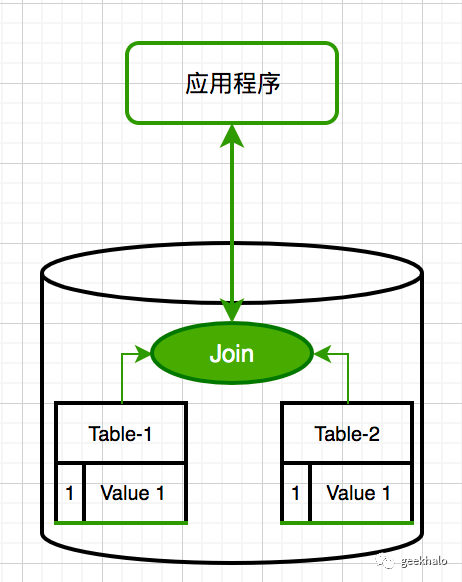
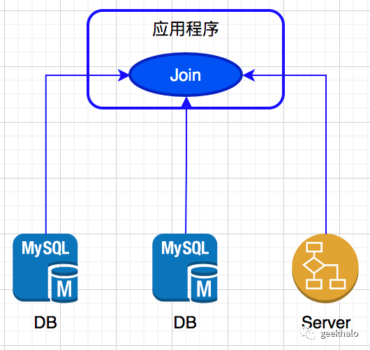

"内存Join"是个无法绕过的话题

首先，我们先简单解释下，什么是“内存Join”。

相信大家对关系数据库的 join 语句肯定不陌生，其作用就是通过关联关系从多个表中查询数据，关联条件和数据聚合全部由 数据库服务完成。

而 内存 Join，简单来说就是把原本数据库帮我们完成的数据聚合操作迁移到应用服务，在应用服务的内存中完成。

数据库join非常简单，但随着系统的发展，内存join变得越来越重要，其核心驱动力有：

1. 微服务。微服务要求“数据资产私有化”，也就是说每个服务的数据库是私有资产，不允许其他服务的直接访问。如果需要访问，只能通过服务所提供的接口完成

2. 分库分表的限制。当数据量超过 MySQL 单实例承载能力时，通常会通过“分库分表”这一技术手段来解决，分库分表后，数据被分散到多个分区中，导致 join 语句失效

3. 性能瓶颈。在高并发情况下，join 存在一定的性能问题，高并发、高性能端场景不适合使用。很多公司规范中对 join 的使用做出了明确的限制

