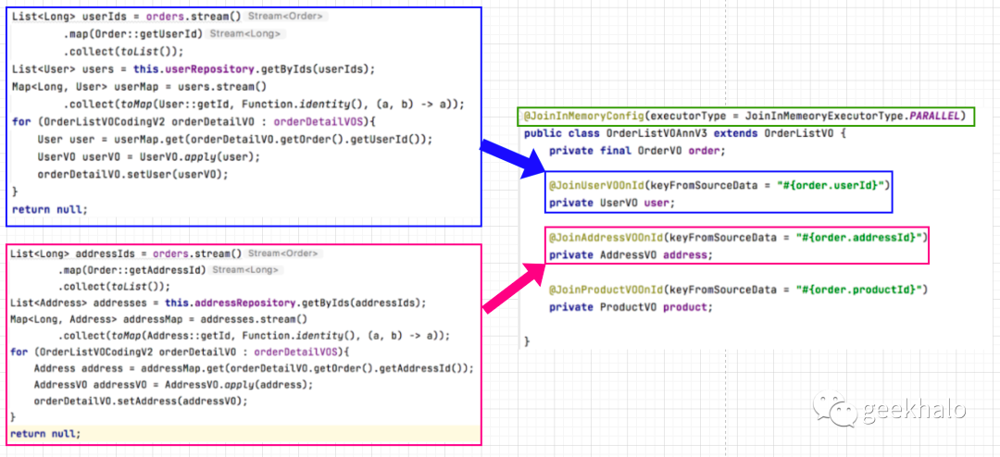
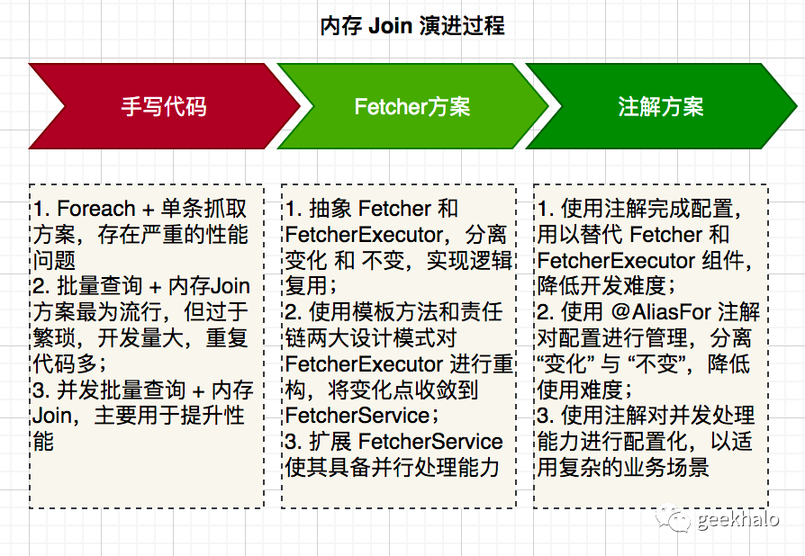

>发现变化，封装变化，管理变化，是开发人员的必备技能。

本篇文章从查询订单这个业务场景为入口，针对数据的内存join进行多次抽象和封装，最终实现“内存Join声明化”。

首先，先看下最终的效果，从直观上感受下“抽象”带来的效率提升。

通过抽象，可以达到如下效果：

1. 左边一坨“模板代码” 等价于右边一个注解

2. 模型需要绑定 UserVO 数据，只需使用 @JoinUserVOOnId 注解进行声明配置即可

3. @JoinInMemoryConfig 注解的 PARALLEL 配置将开启多线程并行处理，以提供性能

神秘背后的本质便是“抽象”。让我们以订单查询为线索，层层递进，最终实现“能力声明化”。

>能力声明化，是抽象的一种高级表现，无需编写代码，通过配置的方式为特定组件进行能力加强。

在正式开始之前，可以先了解下整体的推演流程：

