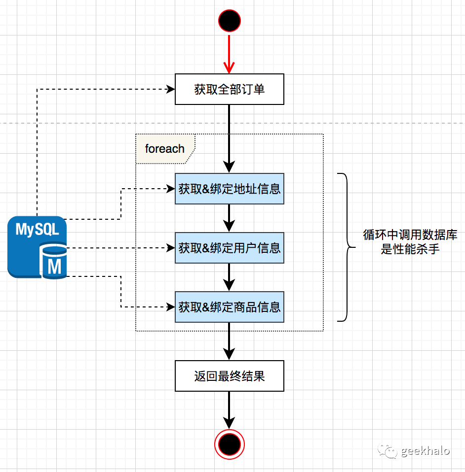
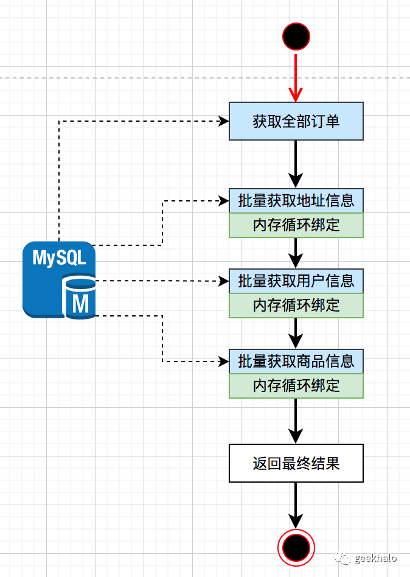
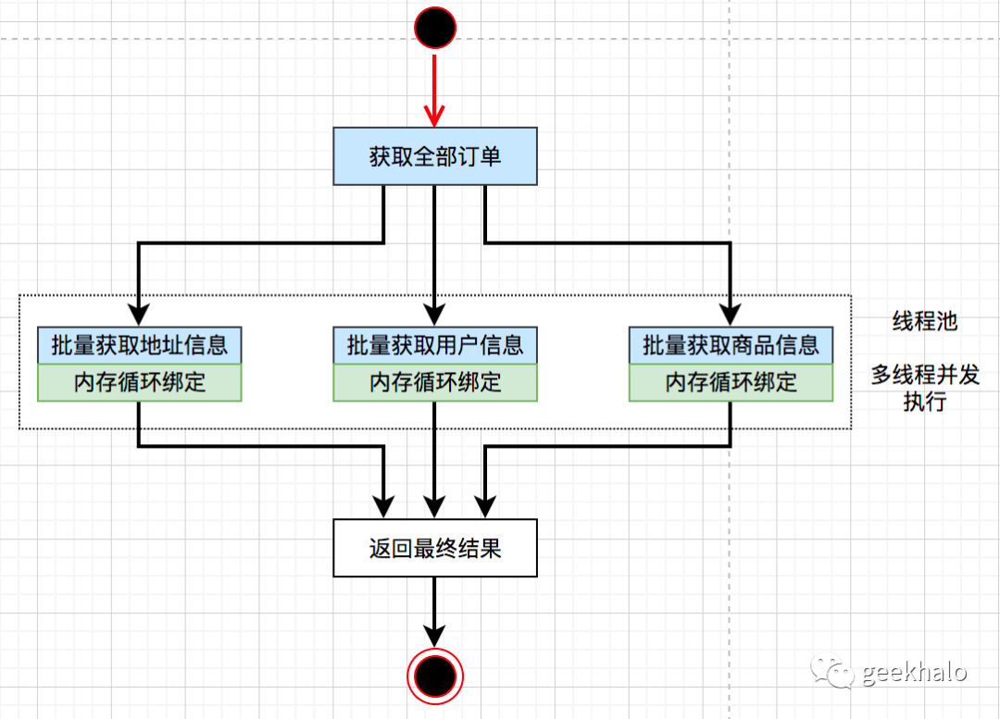

假设，我们是订单中心的一位研发伙伴，需要开发 “我的订单” 模块，其核心接口包括：

1. 我的订单，查询用户的全部订单，包括 订单信息、用户信息、邮寄地址信息、商品信息等；

2. 订单详情，查询某个订单的详细信息，包括 订单信息、用户信息、邮寄地址信息、商品信息、支付信息等；

根据需求定义 OrderService 接口如下：
```java
public interface OrderService {
    // 我的订单
    List<OrderListVO> getByUserId(Long userId);
    // 订单详情
    OrderDetailVO getDetailByOrderId(Long orderId);
}

// 为配合多种实现策略，使用抽象类进行统一
public abstract class OrderListVO {
    public abstract OrderVO getOrder();

    public abstract UserVO getUser();

    public abstract AddressVO getAddress();

    public abstract ProductVO getProduct();
}

// 为配合多种实现策略，使用抽象类进行统一
public abstract class OrderDetailVO {
    public abstract OrderVO getOrder();

    public abstract UserVO getUser();

    public abstract AddressVO getAddress();

    public abstract ProductVO getProduct();

    public abstract List<PayInfoVO> getPayInfo();
}
```

# 3.1. Foreach + 单条抓取方案
这么简单的需求，那不是信手拈来，很快就提供了一版


代码具体如下：
```java
@Service
public class OrderServiceCodingV1 implements OrderService {
    @Autowired
    private OrderRepository orderRepository;
    @Autowired
    private AddressRepository addressRepository;
    @Autowired
    private ProductRepository productRepository;
    @Autowired
    private UserRepository userRepository;
    @Autowired
    private PayInfoRepository payInfoRepository;

    @Override
    public List<OrderListVO> getByUserId(Long userId) {
        // 获取用户订单
        List<Order> orders = this.orderRepository.getByUserId(userId);
        // 依次进行数据绑定
        return orders.stream()
                .map(order -> convertToOrderListVO(order))
                .collect(toList());
    }

    private OrderListVOCodingV1 convertToOrderListVO(Order order) {
        OrderVO orderVO = OrderVO.apply(order);

        OrderListVOCodingV1 orderDetailVO = new OrderListVOCodingV1(orderVO);
        // 绑定地址信息
        Address address = this.addressRepository.getById(order.getAddressId());
        AddressVO addressVO = AddressVO.apply(address);
        orderDetailVO.setAddress(addressVO);
        // 绑定用户信息
        User user = this.userRepository.getById(order.getUserId());
        UserVO userVO = UserVO.apply(user);
        orderDetailVO.setUser(userVO);
        // 绑定商品信息
        Product product = this.productRepository.getById(order.getProductId());
        ProductVO productVO = ProductVO.apply(product);
        orderDetailVO.setProduct(productVO);

        return orderDetailVO;
    }

    @Override
    public OrderDetailVO getDetailByOrderId(Long orderId) {
        // 暂时忽略
        Order order = this.orderRepository.getById(orderId);
        return convertToOrderDetailVO(order);
    }

    private OrderDetailVO convertToOrderDetailVO(Order order) {
        OrderDetailVOCodingV1 orderDetail = new OrderDetailVOCodingV1(OrderVO.apply(order));
        // 获取地址并进行绑定
        Address address = this.addressRepository.getById(order.getAddressId());
        AddressVO addressVO = AddressVO.apply(address);
        orderDetail.setAddress(addressVO);
        // 获取用户并进行绑定
        User user = this.userRepository.getById(order.getUserId());
        UserVO userVO = UserVO.apply(user);
        orderDetail.setUser(userVO);
        // 获取商品并进行绑定
        Product product = this.productRepository.getById(order.getProductId());
        ProductVO productVO = ProductVO.apply(product);
        orderDetail.setProduct(productVO);
        // 获取支付信息并进行绑定
        List<PayInfo> payInfos = this.payInfoRepository.getByOrderId(order.getId());
        List<PayInfoVO> payInfoVOList = payInfos.stream()
                .map(PayInfoVO::apply)
                .collect(toList());
        orderDetail.setPayInfo(payInfoVOList);
        return orderDetail;
    }

}
```

如果真的这样实现，那你离“被跑路”不远了。

为什么会这么说呢？因为 == “我的订单”这个接口存在严重的性能问题! ==

“我的订单”接口具体实现如下：

1. 查询 order 信息
2. 依次对其进行数据抓取
3. 完成数据绑定并返回结果

单个用户请求，数据库访问总次数 = 1（获取用户订单）+ N（订单数量） * 3（需要抓取的关联数据）

其中，N（订单数量） * 3（关联数据数量） 存在性能隐患，存在严重的==读放大效应==。一旦遇到忠实用户，存在成百上千订单，除了超时别无办法。

“订单详情”接口实现，目前问题不大，最大的问题为：== “订单详情”与“我的订单”两个接口存在大量的重复逻辑！==

# 3.2. 批量查询 + 内存Join
首先，我们先来解决 “我的订单”接口的性能问题。从之前的分析可知，性能低下的根本原因在于==“读放大效应”==，数据库请求次数与用户订单数成正比，为了更好的保障性能，最好将数据库操作控制在一个常量。

整体思路为：先批量获取要绑定的数据，然后遍历每一个订单，在内存中完成数据绑定。


实现代码如下：
```java
@Service
public class OrderServiceCodingV2 implements OrderService {
    @Autowired
    private OrderRepository orderRepository;
    @Autowired
    private AddressRepository addressRepository;
    @Autowired
    private ProductRepository productRepository;
    @Autowired
    private UserRepository userRepository;
    @Autowired
    private PayInfoRepository payInfoRepository;

    @Override
    public List<OrderListVO> getByUserId(Long userId) {
        List<Order> orders = this.orderRepository.getByUserId(userId);

        List<OrderListVOCodingV2> orderDetailVOS = orders.stream()
                .map(order -> new OrderListVOCodingV2(OrderVO.apply(order)))
                .collect(toList());
        // 批量获取用户，并依次进行绑定
        List<Long> userIds = orders.stream()
                .map(Order::getUserId)
                .collect(toList());
        List<User> users = this.userRepository.getByIds(userIds);
        Map<Long, User> userMap = users.stream()
                .collect(toMap(User::getId, Function.identity(), (a, b) -> a));
        for (OrderListVOCodingV2 orderDetailVO : orderDetailVOS){
            User user = userMap.get(orderDetailVO.getOrder().getUserId());
            UserVO userVO = UserVO.apply(user);
            orderDetailVO.setUser(userVO);
        }
        // 批量获取地址，并依次进行绑定
        List<Long> addressIds = orders.stream()
                .map(Order::getAddressId)
                .collect(toList());
        List<Address> addresses = this.addressRepository.getByIds(addressIds);
        Map<Long, Address> addressMap = addresses.stream()
                .collect(toMap(Address::getId, Function.identity(), (a, b) -> a));
        for (OrderListVOCodingV2 orderDetailVO : orderDetailVOS){
            Address address = addressMap.get(orderDetailVO.getOrder().getAddressId());
            AddressVO addressVO = AddressVO.apply(address);
            orderDetailVO.setAddress(addressVO);
        }
        // 批量获取商品，并依次进行绑定
        List<Long> productIds = orders.stream()
                .map(Order::getProductId)
                .collect(toList());
        List<Product> products = this.productRepository.getByIds(productIds);
        Map<Long, Product> productMap = products.stream()
                .collect(toMap(Product::getId, Function.identity(), (a, b) -> a));
        for (OrderListVOCodingV2 orderDetailVO : orderDetailVOS){
            Product product = productMap.get(orderDetailVO.getOrder().getProductId());
            ProductVO productVO = ProductVO.apply(product);
            orderDetailVO.setProduct(productVO);
        }

        return orderDetailVOS.stream()
                .collect(toList());
    }

    @Override
    public OrderDetailVO getDetailByOrderId(Long orderId) {
        // 暂时忽略
        Order order = this.orderRepository.getById(orderId);
        return convertToOrderDetailVO(order);
    }

    private OrderDetailVO convertToOrderDetailVO(Order order) {
        // 暂时忽略

        return orderDetail;
    }
}
```

调整之后，对于“我的订单”接口，单个用户请求==**数据库的访问次数变成了常量(4)**==。

如果你是这么实现的，那恭喜你，你已步入==**合格程序员行列**==。

# 3.3. 并行批量查询 + 内存Join
批量查询+内存Join 方案能满足大部分场景，如果要抓取的数据太多，也就是数据库访问这个==常量变大==时，性能也会越来越差。

原因很简单，由于串行执行，==整体耗时 = 获取订单耗时 + sum(抓取数据耗时)==

聪明的同学早就跃跃欲试，这个我会：==多线程并行执行呗。==

是的，基于 Future 的实现如下（还有很多版本，比如 CountDownLatch）

整体设计如下：


示例代码如下：
```java
@Service
public class OrderServiceCodingV3 implements OrderService {
    private ExecutorService executorService;

    @Autowired
    private OrderRepository orderRepository;
    @Autowired
    private AddressRepository addressRepository;
    @Autowired
    private ProductRepository productRepository;
    @Autowired
    private UserRepository userRepository;
    @Autowired
    private PayInfoRepository payInfoRepository;

    @PostConstruct
    public void init(){
        // 初始化线程池（不要使用Executors，这里只是演示，需要对资源进行评估）
        this.executorService = Executors.newFixedThreadPool(20);
    }

    @SneakyThrows
    @Override
    public List<OrderListVO> getByUserId(Long userId) {
        List<Order> orders = this.orderRepository.getByUserId(userId);

        List<OrderListVOCodingV2> orderDetailVOS = orders.stream()
                .map(order -> new OrderListVOCodingV2(OrderVO.apply(order)))
                .collect(toList());

        List<Callable<Void>> callables = Lists.newArrayListWithCapacity(3);
        // 创建异步任务
        callables.add(() -> {
            // 批量获取用户，并依次进行绑定
            List<Long> userIds = orders.stream()
                    .map(Order::getUserId)
                    .collect(toList());
            List<User> users = this.userRepository.getByIds(userIds);
            Map<Long, User> userMap = users.stream()
                    .collect(toMap(User::getId, Function.identity(), (a, b) -> a));
            for (OrderListVOCodingV2 orderDetailVO : orderDetailVOS){
                User user = userMap.get(orderDetailVO.getOrder().getUserId());
                UserVO userVO = UserVO.apply(user);
                orderDetailVO.setUser(userVO);
            }
            return null;
        });
        // 创建异步任务
        callables.add(() ->{
            // 批量获取地址，并依次进行绑定
            List<Long> addressIds = orders.stream()
                    .map(Order::getAddressId)
                    .collect(toList());
            List<Address> addresses = this.addressRepository.getByIds(addressIds);
            Map<Long, Address> addressMap = addresses.stream()
                    .collect(toMap(Address::getId, Function.identity(), (a, b) -> a));
            for (OrderListVOCodingV2 orderDetailVO : orderDetailVOS){
                Address address = addressMap.get(orderDetailVO.getOrder().getAddressId());
                AddressVO addressVO = AddressVO.apply(address);
                orderDetailVO.setAddress(addressVO);
            }
            return null;
        });
        // 创建异步任务
        callables.add(() -> {
            // 批量获取商品，并依次进行绑定
            List<Long> productIds = orders.stream()
                    .map(Order::getProductId)
                    .collect(toList());
            List<Product> products = this.productRepository.getByIds(productIds);
            Map<Long, Product> productMap = products.stream()
                    .collect(toMap(Product::getId, Function.identity(), (a, b) -> a));
            for (OrderListVOCodingV2 orderDetailVO : orderDetailVOS){
                Product product = productMap.get(orderDetailVO.getOrder().getProductId());
                ProductVO productVO = ProductVO.apply(product);
                orderDetailVO.setProduct(productVO);
            }
            return null;
        });

        // 执行异步任务
        this.executorService.invokeAll(callables);

        return orderDetailVOS.stream()
                .collect(toList());
    }

    @Override
    public OrderDetailVO getDetailByOrderId(Long orderId) {
        // 暂时忽略
        Order order = this.orderRepository.getById(orderId);
        return convertToOrderDetailVO(order);
    }

    private OrderDetailVO convertToOrderDetailVO(Order order) {
      // 暂时忽略
    }
}
```

多线程并发执行，==**整体耗时 = 获取订单耗时 + max(抓取数据耗时)**==

如果你能够这样实现的，那恭喜你，你已步入==**高级程序员行列**==。

然后呢，到此为止了？NO，接下来才是高潮！！！

让我们==打开认知==，开启==“**抽象+封装**”==之旅。

