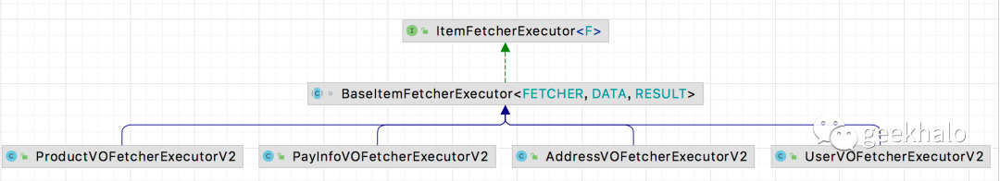

仔细研究上述代码，寻找里面的==**“变与不变”**==，你会发现：

由于“我的订单” 和 “订单详情” 返回的是==不同的VO==，导致在实现绑定操作时写了**两套基本一样的逻辑**；

Address、User、Product的绑定==**逻辑骨架是一样的**==，一些==**细节操作存在差异**==；

找到逻辑中的变化点，接下来便是有针对性的进行封装。

# 4.1. 消除方法中的重复代码
对于 “我的订单” 和 “订单详情” 返回==不同的 VO==，该怎么处理呢？

非常简单，思路如下：

**【不变】** 抽象出“行为接口” Fetcher，统一操作行为

**【变化】** 基于多态，不同的 VO 派生自相同的接口，但可以自己定义实现，从而实现个性化变化

整体设计如下：


简单示例如下：
```java
// 以 UserVO 为例，ProductVO、AddressVO，PayInfoVO 基本一致，不在赘述
public interface UserVOFetcherV1 {
    Long getUserId();

    void setUser(UserVO user);
}
// OrderDetailVO 实现对应的接口，为了突出重点暂时忽略具体实现
public class OrderDetailVOFetcherV1 extends OrderDetailVO
    implements AddressVOFetcherV1,
        ProductVOFetcherV1,
        UserVOFetcherV1,
        PayInfoVOFetcherV1{
}
// OrderListVO 实现对应接口，为了突出重点暂时忽略具体实现
public class OrderListVOFetcherV1 extends OrderListVO
    implements AddressVOFetcherV1,
        ProductVOFetcherV1,
        UserVOFetcherV1 {
}
```

有了统一的操作接口，接下来便是抽取具体的绑定逻辑，以 UserVOFetcherExecutor 为例：

```java
@Component
public class UserVOFetcherExecutorV1 {
    @Autowired
    private UserRepository userRepository;

    public void fetch(List<? extends UserVOFetcherV1> fetchers){
        List<Long> ids = fetchers.stream()
                .map(UserVOFetcherV1::getUserId)
                .distinct()
                .collect(Collectors.toList());

        List<User> users = userRepository.getByIds(ids);

        Map<Long, User> userMap = users.stream()
                .collect(toMap(user -> user.getId(), Function.identity()));

        fetchers.forEach(fetcher -> {
            Long userId = fetcher.getUserId();
            User user = userMap.get(userId);
            if (user != null){
                UserVO userVO = UserVO.apply(user);
                fetcher.setUser(userVO);
            }
        });
    }
}
```
实现逻辑没有变化，最重要的变化在于“入参类型”，不在是具体的 VO，而是抽象的 UserVOFetcher 接口。

>AddressVOFetcherExecutor、ProductVOFetcherExecutor、PayInfoVOFetcherExecutor 与 UserVOFetcherExecutorV1 逻辑基本一致，篇幅问题不在赘述。

这样一个小小的调整，会给使用方带来什么便利？一起看下使用方的变化：
```java
@Service
public class OrderServiceFetcherV1 implements OrderService {
    @Autowired
    private OrderRepository orderRepository;
    @Autowired
    private AddressVOFetcherExecutorV1 addressVOFetcherExecutorV1;
    @Autowired
    private ProductVOFetcherExecutorV1 productVOFetcherExecutorV1;
    @Autowired
    private UserVOFetcherExecutorV1 userVOFetcherExecutorV1;
    @Autowired
    private PayInfoVOFetcherExecutorV1 payInfoVOFetcherExecutorV1;

    @Override
    public List<OrderListVO> getByUserId(Long userId) {
        List<Order> orders = this.orderRepository.getByUserId(userId);

        List<OrderListVOFetcherV1> orderDetailVOS = orders.stream()
                .map(order -> new OrderListVOFetcherV1(OrderVO.apply(order)))
                .collect(toList());
        // 直接使用 FetcherExecutor 完成数据绑定
        this.addressVOFetcherExecutorV1.fetch(orderDetailVOS);
        this.productVOFetcherExecutorV1.fetch(orderDetailVOS);
        this.userVOFetcherExecutorV1.fetch(orderDetailVOS);

        return orderDetailVOS.stream()
                .collect(toList());
    }

    @Override
    public OrderDetailVO getDetailByOrderId(Long orderId) {
        Order order = this.orderRepository.getById(orderId);
        OrderDetailVOFetcherV1 orderDetail = new OrderDetailVOFetcherV1(OrderVO.apply(order));
        List<OrderDetailVOFetcherV1> orderDetailVOS = Arrays.asList(orderDetail);
        // 直接使用 FetcherExecutor 完成数据绑定
        this.addressVOFetcherExecutorV1.fetch(orderDetailVOS);
        this.productVOFetcherExecutorV1.fetch(orderDetailVOS);
        this.userVOFetcherExecutorV1.fetch(orderDetailVOS);
        this.payInfoVOFetcherExecutorV1.fetch(orderDetailVOS);
        return orderDetail;
    }
}
```

两个方法直接使用 FetcherExecutor 完成数据抓取和绑定，实现了==绑定逻辑的复用==。

如果再有 VO 需要进行数据绑定，只需：

1. VO 实现 XXXFetcher 接口，实现对应方法，提供关联数据并完成数据绑定

2. 使用 XXXFetcherExecutor 完成数据绑定

至此，面对新业务基本上与“绑定逻辑”说再见了。

# 4.2. 重构绑定逻辑
接下来让我们一起聚焦于绑定逻辑，先对比下上述的UserVOFetcherExecutor 与下面的 AddressVOFetcherExecutor， 找到里面的变化与不变：
```java
@Component
public class AddressVOFetcherExecutorV1 {
    @Autowired
    private AddressRepository addressRepository;

    public void fetch(List<? extends AddressVOFetcherV1> fetchers){
        // 获取关联信息
        List<Long> ids = fetchers.stream()
                .map(AddressVOFetcherV1::getAddressId)
                .distinct()
                .collect(Collectors.toList());
        // 查询关联数据
        List<Address> addresses = addressRepository.getByIds(ids);

        // 转为为 Map
        Map<Long, Address> addressMap = addresses.stream()
                .collect(toMap(address -> address.getId(), Function.identity()));

        // 依次进行数据绑定
        fetchers.forEach(fetcher -> {
            Long addressId = fetcher.getAddressId();
            Address address = addressMap.get(addressId);
            if (address != null){
                // 转换为 VO
                AddressVO addressVO = AddressVO.apply(address);
                // 将数据写回到结果
                fetcher.setAddress(addressVO);
            }
        });
    }
}

```

仔细观察，会发现：

==**【不变】逻辑骨架基本一致**==，基本是由：

1. 获取关联信息

2. 查询关联数据

3. 将其转换为 Map

4. 讲数据转化为 VO

5. 将 VO 绑定到结果对象

==**【变化】实现细节存在差异**==；

1. 从什么接口中获取关联信息

2. 如何查询关联数据

3. 转换为 Map 的键是什么

4. 如何将数据转换为 VO

5. 如何完成数据的绑定

熟悉设计模式的伙伴是否眼前一亮？停顿一下好好回想一下，哪种模式就是用来处理这种问题的？

答案便是：**模板方法模式**

整体思想为：

**将不变的逻辑骨架封装在父类方法

将变化的实现细节放在子类中进行扩展**

整体设计如下：


抽取公共父类如下：
```java
abstract class BaseItemFetcherExecutor<FETCHER extends ItemFetcher, DATA, RESULT>
        implements ItemFetcherExecutor<FETCHER>{

    @Override
    public void fetch(List<FETCHER> fetchers) {
        // 获取关联信息
        List<Long> ids = fetchers.stream()
                .map(this::getFetchId)
                .distinct()
                .collect(Collectors.toList());
        // 查询关联数据
        List<DATA> datas = loadData(ids);
        // 转为为 Map
        Map<Long, List<DATA>> dataMap = datas.stream()
                .collect(groupingBy(this::getDataId));
        // 依次进行数据绑定
        fetchers.forEach(fetcher -> {
            Long id = getFetchId(fetcher);
            List<DATA> ds = dataMap.get(id);
            if (ds != null){
                // 转换为 VO
                List<RESULT> result = ds.stream()
                        .map( data -> convertToVo(data))
                                .collect(Collectors.toList());
                // 将数据写回到结果
                setResult(fetcher, result);
            }
        });
    }

    protected abstract Long getFetchId(FETCHER fetcher);

    protected abstract List<DATA> loadData(List<Long> ids);

    protected abstract Long getDataId(DATA data);

    protected abstract RESULT convertToVo(DATA data);

    protected abstract void setResult(FETCHER fetcher, List<RESULT> result);
}

```

基于 BaseItemFetcherExecutor 的 UserFetcherExecutor 如下：
```java
@Component
public class UserVOFetcherExecutorV2
    extends BaseItemFetcherExecutor<UserVOFetcherV2, User, UserVO>{
    @Autowired
    private UserRepository userRepository;

    @Override
    protected Long getFetchId(UserVOFetcherV2 fetcher) {
        return fetcher.getUserId();
    }

    @Override
    protected List<User> loadData(List<Long> ids) {
        return this.userRepository.getByIds(ids);
    }

    @Override
    protected Long getDataId(User user) {
        return user.getId();
    }

    @Override
    protected UserVO convertToVo(User user) {
        return UserVO.apply(user);
    }

    @Override
    protected void setResult(UserVOFetcherV2 fetcher, List<UserVO> userVO) {
        if (CollectionUtils.isNotEmpty(userVO)) {
            fetcher.setUser(userVO.get(0));
        }
    }

    @Override
    public boolean support(Class<UserVOFetcherV2> cls) {
        // 暂时忽略，稍后会细讲
        return UserVOFetcherV2.class.isAssignableFrom(cls);
    }
}

```

UserVOFetcherExecutor究竟发生什么变化呢？好像变得更复杂了：

1. 从代码量角度（行数）变得更多了，因为类函数明显变大

2. 从复杂度角度（逻辑）变得更加简单，每个方法基本都是一两句语句

那我们究竟得到了什么好处？可以花几分钟好好思考一下！！！

在说结果之前，让我们看下另一个变化点。回想下 FetcherExecutor 的执行点，如下：
```java
@Override
    public List<OrderListVO> getByUserId(Long userId) {
        List<Order> orders = this.orderRepository.getByUserId(userId);

        List<OrderListVOFetcherV1> orderDetailVOS = orders.stream()
                .map(order -> new OrderListVOFetcherV1(OrderVO.apply(order)))
                .collect(toList());
        // 手工调用，OrderListVO 实现新接口，需要增加新的依赖和调用
        this.addressVOFetcherExecutorV1.fetch(orderDetailVOS);
        this.productVOFetcherExecutorV1.fetch(orderDetailVOS);
        this.userVOFetcherExecutorV1.fetch(orderDetailVOS);

        return orderDetailVOS.stream()
                .collect(toList());
    }

    @Override
    public OrderDetailVO getDetailByOrderId(Long orderId) {
        Order order = this.orderRepository.getById(orderId);
        OrderDetailVOFetcherV1 orderDetail = new OrderDetailVOFetcherV1(OrderVO.apply(order));
        List<OrderDetailVOFetcherV1> orderDetailVOS = Arrays.asList(orderDetail);
        // 手工调用，OrderDetailVO 实现新接口，需要增加新的依赖和调用
        this.addressVOFetcherExecutorV1.fetch(orderDetailVOS);
        this.productVOFetcherExecutorV1.fetch(orderDetailVOS);
        this.userVOFetcherExecutorV1.fetch(orderDetailVOS);
        this.payInfoVOFetcherExecutorV1.fetch(orderDetailVOS);
        return orderDetail;
    }
```

其实，需要调用哪些 FetcherExecutor 完全可以由 VO 实现的接口来确定。也就是说，==需要绑定新数据，只需 VO 继承并实现新的 Fetcher 接口即可。==

对此，我们需要：

1. 一个统一的访问入口，对外提供访问

2. 每个 FetcherExecutor 能够识别 VO 并执行绑定逻辑

哪个设计模式是用来解决这个问题？花几分钟好好思考一下！

答案是：==**责任链模型**==

>标准的责任链模式用起来比较繁琐，在 Spring 实现中大量使用他的一种变现，及提供一个验证接口，由组件自身完成判断，用于决定是否执行自身逻辑。

整体设计如下：


首先，为了统一 FetcherExecutor 的行为，抽取通用接口：
```java
public interface ItemFetcherExecutor<F extends ItemFetcher> {
    /**
     * 该组件是否能处理 cls 类型
     * @param cls
     * @return
     */
    boolean support(Class<F> cls);

    /**
     *  执行真正的数据绑定
     * @param fetchers
     */
    void fetch(List<F> fetchers);
}
```

具体的实现，可以见 UserVOFetcherExecutorV2 的 support 方法：
```java
@Override
public boolean support(Class<UserVOFetcherV2> cls) {
    return UserVOFetcherV2.class.isAssignableFrom(cls);
}
```

实现逻辑非常简单，只是判断 cls 是否实现了 UserVOFetcherV2 接口。

有了 FetcherExecutor 组件后，接下来就是为其提供统一的访问入口：

```java
@Service
public class FetcherService {
    @Autowired
    private List<ItemFetcherExecutor> itemFetcherExecutors;

    public <F extends ItemFetcher> void fetch(Class<F> cls, List<F> fetchers){
        if (CollectionUtils.isNotEmpty(fetchers)){
            this.itemFetcherExecutors.stream()
                    // 是否能处理该类型
                    .filter(itemFetcherExecutor -> itemFetcherExecutor.support(cls))
                    // 执行真正的绑定
                    .forEach(itemFetcherExecutor -> itemFetcherExecutor.fetch(fetchers));
        }
    }
}
```

逻辑即为简单，依次遍历 FetcherExecutor，根据 support 执行结果，执行 fetch 逻辑。

>【小常识】Spring 可以将容器中的全部实现直接注入到 List<Bean>。在上述代码中，将会把所有的 ItemFetcherExecutor 实现注入到 itemFetcherExecutors 属性。因此，在新增 FetcherExecutor 时，只需将其声明为 Spring Bean，无需调整代码逻辑。

OK，我们有了 FetcherService 提供统一的数据绑定能力，原来 OrderServiceFetcher 中 fetch 操作的变化点转移到 FetcherService，自身变得非常稳定。具体如下：

```java
@Service
public class OrderServiceFetcherV2 implements OrderService {
    @Autowired
    private OrderRepository orderRepository;
    @Autowired
    private FetcherService fetcherService;

    @Override
    public List<OrderListVO> getByUserId(Long userId) {
        List<Order> orders = this.orderRepository.getByUserId(userId);

        List<OrderListVOFetcherV2> orderDetailVOS = orders.stream()
                .map(order -> new OrderListVOFetcherV2(OrderVO.apply(order)))
                .collect(toList());
        // VO 数据绑定发生变化，只需调整 VO 实现接口，此处无需变化
        fetcherService.fetch(OrderListVOFetcherV2.class, orderDetailVOS);

        return orderDetailVOS.stream()
                .collect(toList());
    }

    @Override
    public OrderDetailVO getDetailByOrderId(Long orderId) {
        Order order = this.orderRepository.getById(orderId);
        OrderDetailVOFetcherV2 orderDetail = new OrderDetailVOFetcherV2(OrderVO.apply(order));
        // VO 数据绑定发生变化，只需调整 VO 实现接口，此处无需变化
        fetcherService.fetch(OrderDetailVOFetcherV2.class, Arrays.asList(orderDetail));
        return orderDetail;
    }
}
```

终于，我们将变化收敛到 VO 内，VO 需要绑定新的数据，只需实现对应接口即可。

# 4.3. 并发绑定
经过重构，代码结构变得非常清晰，如果想通过多线程并发方式提供性能，需要调整哪些组件呢？好好想想！！！

只需对FetcherService进行调整，让我们来一个并发版本，具体如下：
```java
@Service
public class ConcurrentFetcherService {
    private ExecutorService executorService;
    @Autowired
    private List<ItemFetcherExecutor> itemFetcherExecutors;

    @PostConstruct
    public void init(){
        this.executorService = Executors.newFixedThreadPool(20);
    }

    @SneakyThrows
    public <F extends ItemFetcher> void fetch(Class<F> cls, List<F> fetchers){
        if (CollectionUtils.isNotEmpty(fetchers)){
            // 创建异步执行任务
            List<Callable<Void>> callables = this.itemFetcherExecutors.stream()
                    .filter(itemFetcherExecutor -> itemFetcherExecutor.support(cls))
                    .map(itemFetcherExecutor -> (Callable<Void>) () -> {
                        itemFetcherExecutor.fetch(fetchers);
                        return null;
                    }).collect(Collectors.toList());
            // 线程池中并行执行
            this.executorService.invokeAll(callables);
        }
    }
}
```

OrderServiceFetcherV3 只需使用 ConcurrentFetcherService 替代 原来的 FetcherService 并拥有了并发能力。

