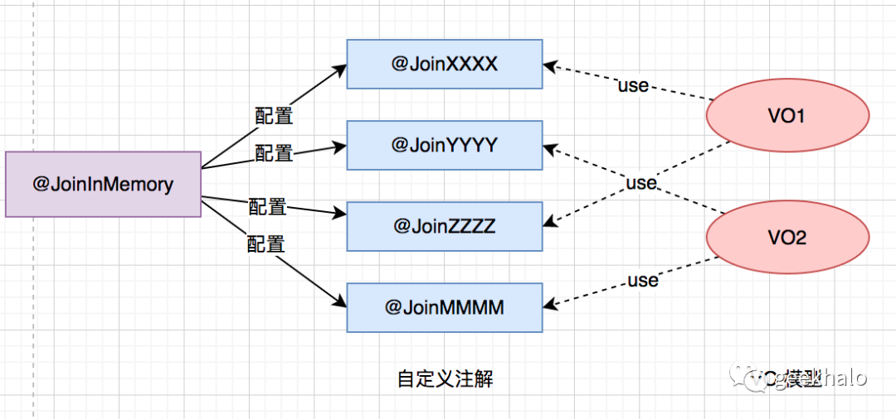

# 6.1.将定义注解视为最佳实践

@JoinInMemory 注解上配置的信息太多，如果直接在业务代码中使用，非常难以维护，当每个配置发生变化后，很难一次性修改到位。所以，建议只将他作为“原注解”使用。

整体思路详见：



# 6.2. 注意线程池隔离
对于不同的数据绑定需求，建议使用不同的线程池，从资源层面对不同功能进行隔离，从而将由于依赖接口发生阻塞导致线程耗尽所造成的影响控制在最小范围。

@JoinInMemoryConfig 的 executorName 属性配置的便是执行器名称，不配置直接使用 “defaultExecutor”，具体代码如下：

```java
@Bean
public ExecutorService defaultExecutor(){
    BasicThreadFactory basicThreadFactory = new BasicThreadFactory.Builder()
            .namingPattern("JoinInMemory-Thread-%d")
            .daemon(true)
            .build();
    int maxSize = Runtime.getRuntime().availableProcessors() * 3;
    return new ThreadPoolExecutor(0, maxSize,
            60L, TimeUnit.SECONDS,
            new SynchronousQueue<>(),
            basicThreadFactory,
            new ThreadPoolExecutor.CallerRunsPolicy());
}

```

如需使用自定义线程池需：

1. 自定义线程池，并将其注册到Spring 容器

2. @JoinInMemoryConfig executorName 设置为线程池的 bean name

# 7. 小结
推导逻辑有点长不知道你get到多少，先简单回顾一下：

1. 今天面对的问题是：如何在应用成进行数据 Join 操作；

2. 我们以我的订单和订单详情两个接口为业务切入点，层层进行抽象，发现变化、封装变化、管理变化

3. 首先是手写代码，包括 foreach+单条抓取，批量查询+内存Join，并行查询 + 内存Join。在这个层次基本没有抽象可言，存在大量重复代码，系统扩展性低

4. 其次是 Fetcher方案，为了分离“变化”与“不变”抽取出 Fetcher 和 FetcherExecutor 两个接口，并使用模板方法和责任链模式对其进行抽象，提升系统的扩展性，但实现过于繁琐不便于推广

5. 最后是注解方案，使用 @JoinInMemory 注解完成繁琐的配置工作，将通用配置保留在自定义注解进行统一管理，基于 @AliasFor 完成入参的配置，还可以使用 @JoinInMemoryConfig 开启并发处理

不知道你有什么感触，接下来，有什么计划？

1. 没有改变，习惯怎么做就怎么做？

2. 将 JoinInMemory 引入到自己的工程？

3. 尝试发现项目中的“变化”和“不变”，尝试自己封装，增加抽象能力？

